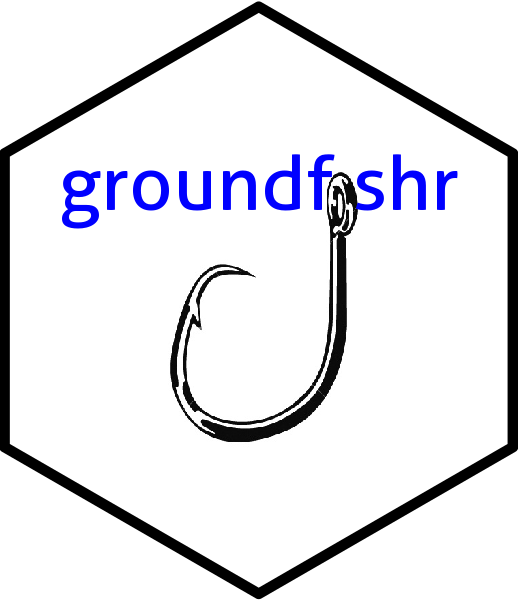

# groundfishr 

# groundfishr

The goal of groundfishr is to create a clear workflow for pulling and cleaning data for fishery stock assessments at AFSC.
It utilizes a "project oriented workflow" via RStudio (base R is ok, though you must use `here::here()`).
You must be able to have a connection to the AFSC & AKFIN (Answers) data servers (e.g., VPN if offsite), and have usernames/passwords setup.

<!-- badges: start -->
<!-- badges: end -->


## Installation

You can install the released version of groundfishr from [github](https://github.com/BenWilliams-NOAA/groundfishr) with:

``` r
# install.packages("devtools")
devtools::install_github("BenWilliams-NOAA/groundfishr")
```

## Documentation

Complete descriptions are available on the [groundfishr](https://benwilliams-noaa.github.io/groundfishr/) webpage.

## Disclaimer

This repository is a software product and is not official communication of the National Oceanic and Atmospheric Administration (NOAA), or the United States Department of Commerce (DOC). All NOAA GitHub project code is provided on an 'as is' basis and the user assumes responsibility for its use. Any claims against the DOC or DOC bureaus stemming from the use of this GitHub project will be governed by all applicable Federal law. Any reference to specific commercial products, processes, or services by service mark, trademark, manufacturer, or otherwise, does not constitute or imply their endorsement, recommendation, or favoring by the DOC. The DOC seal and logo, or the seal and logo of a DOC bureau, shall not be used in any manner to imply endorsement of any commercial product or activity by the DOC or the United States Government.

